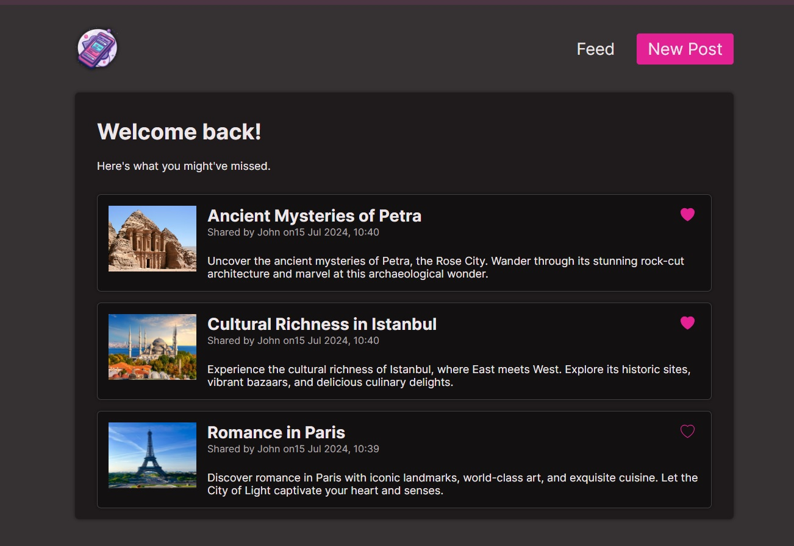

# 📱 Blog App

## 📝 Description

Blog App is a Tech Assessment Project to demonstrate knowledge of Next.js. It shows up posts and allows you to mutate data from a sqlite database.

## 🚀 Getting Started

1. Install the necessary dependencies: Before running the development server, make sure to install all project dependencies. You can do this with one of the following commands:

```bash
npm install
```

2. Run the development server: You can start the development server using one of the following commands:

```bash
npm run dev
```

## 🗄️ Database

This application uses SQLite as its database. Ensure that the SQLite database is properly set up before running the application.

It includes a built-in db through the use of this file `services\post.services.ts` which recreates the db if it doesn't exist.

**Note:** Image files must be stored in assets and also in public allowing the db url access the folder based on the url provided.

Open [http://localhost:3000](http://localhost:3000) with your browser to see the result.

## 🛠️ Code Quality and Best Practices

The platform ensures high code quality and follows best practices.

## 📚 Base libraries used

- **Next.js:** As the chosen framework to build with.
- **React:** As the UI library in the background.
- **TypeScript:** Adding strong static types and advanced features to improve large-scale development and code maintainability.
- **Cloudinary:** to store image files.
  You´ll find a .env.local-sample file where you have to store tha info from your Cloudinary dashboard
- **Sharp:**For production image optimization with Next.js, you need to install the sharp package.

```bash
  CLOUDINARY_CLOUD_NAME=
  CLOUDINARY_API_KEY=
  CLOUDINARY_API_SECRET=
```

## 🎨 UX/UI

- **CSS Modules:** The application utilizes global CSS styles and CSS Modules for precise styling on each component that requires it.

## 🌟 Special Features

- **Server Actions:** The application uses Server Actions to efficiently and securely handle server actions.
- **Optimistic updates:** is a special feature from the React library and it allows applications to display changes in the user interface immediately, even before they are confirmed by the server. This enhances the user experience by making the application appear faster and more responsive.
- **Revalidate front client routes:** This feature ensures that the data for client-side routes is refreshed and up-to-date by revalidating it at specified intervals or upon certain triggers. This helps maintain the accuracy and relevance of the displayed information without requiring a full page reload.

## 📦 Prepare for production

1. Install image optimization package sharp.

```bash
npm i sharp
```

2. Creating an optimized production build

```bash
npm run build
```

3. Start the production build

```bash
npm run start
```

4. Demo deployed in Vercel

```bash
https://next-blog-app-nextjs14-typescript-sqlite.vercel.app/
```

📷 Demo image:


## 🚀 Improvements

- **Zod** for form validations

## 🤝 Contributions

Contributions are welcome. If you would like to contribute, please follow these steps:

1. Fork the repository.
2. Create a new branch (git checkout -b feature/new-feature).
3. Make your changes and commit them (git commit -am 'Add new feature').
4. Push your branch (git push origin feature/new-feature).
   Open a Pull Request.
